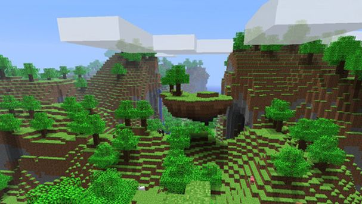

CAPÍTULO 2. PROCEDIMENTAL
=========================

2.1 La generación procedimental
-------------------------------

Hablando en términos generales, la **generación procedimental**, o **generación por procedimientos**, es eso mismo, generar **contenido** por medio **algoritmos** en vez de manera manual. Suele estar relacionado con aplicación de computación gráfica y diseño de niveles en videojuegos.

Pero vamos a usar una definición más precisa para este proyecto y describir la generación procedimental de contenido como **la creación de contenido para videojuegos mediante algoritmos y con una limitada e indirecta intervención del usuario**.

### ¿Procedimental o procedural? ###

La razón por la que planteo esta pregunta es porque si buscamos en la Real Academia Española (RAE) la palabra **procedimental** obtenemos la siguiente definición:

*“adj. Perteneciente o relativo al procedimiento (método de ejecutar
algunas cosas).”*

Pero si buscamos **procedural** no encontramos nada, y es que esta palabra es constantemente utilizada incorrectamente como anglicismo de la palabra, probablemente porque podría pasar por una palabra española y porque es más rápida y sencillo de pronunciar. En entornos no académicos este anglicismo es la palabra más utilizada por encima de la que encontramos en la RAE.

En cualquier caso no quiero ser demasiado meticuloso con el uso de estas palabras y quiero dejar claro que en este documento voy a intentar utilizar la versión correcta “**procedimental**”, pero que tanto procedimental como procedural son dos palabras que se refieren a lo mismo y que ambas son utilizadas con la misma frecuencia al hablar de este tema.

### Aleatorio vs procedimental ###

La definición que hemos visto indica que el contenido se genera por procedimientos, pero en ningún momento menciona que se deben aplicar ciertos requisitos. Decir que algo es procedimental frente a aleatorio no es la forma correcta de plantearlo, ya que no son exclusivos uno del otro. El uso de algoritmos para la generación de contenido implica el uso de valores aleatorios, pero siempre dentro de ciertos parámetros, con lo que los resultados son, en cierta medida, predecibles. Decir que algo es simplemente aleatorio no implica más que la semilla inicial, y los resultados pueden ser totalmente impredecibles, pero el uso de aleatoriedad en procedimientos para la generación de contenido es esencial.

### ¿Y a qué nos referimos con contenido? ###

Pues prácticamente a casi todo lo que podemos encontrar en el juego, desde **objetos** físicos a las mismas **estadísticas** o **propiedades** de estos, así como la **música**, **historia** y **misiones** e incluso las propias **reglas** del juego. Aspectos que quedarían fuera de esta definición serían básicamente el mismo motor del juego o la inteligencia artificial, aunque para esta última existen muchos estudios y métodos de aprendizaje automático que en cierta manera se asemejan a la definición de generación procedimental de contenido, pero realmente no generan nuevo contenido en sí.

Otro aspecto del **contenido** que se genere es que debe hacer el juego “**jugable**”. Se debe poder terminar un nivel generado o utilizar un objeto generado con estas técnicas, que tenga una **utilidad** dentro del tipo de asset al que pertenece. Si es un arma, deberíamos poder usarla para luchar contra enemigos, si es una decoración de escenario, debería estar en el contexto adecuado, situada por el nivel o habitación en una posición razonable.

### Videojuegos

Este es un término mucho más difícil de definir, ya que existen muchos géneros que podrían decirse que están al borde de lo que es un videojuego o cualquier otro tipo de obra audiovisual interactiva.

Una de las definiciones más clásicas describe un videojuego como:

> *“Dispositivo electrónico que permite, mediante mandos apropiados, simular juegos en las pantallas de un televisor o de un ordenador.”*

_De la RAE: [*http://buscon.rae.es/drae/srv/search?val=videojuego*](http://buscon.rae.es/drae/srv/search?val=videojuego)_

En la Wikipedia tenemos una definición más preciso
 *“Un videojuego o juego de video es un juego electrónico en el que una o más personas interactúan, por medio de un controlador, con un dispositivo dotado de imágenes de vídeo. Este dispositivo electrónico, conocido genéricamente como «plataforma», puede ser una computadora, una máquina arcade, una videoconsola o un dispositivo portátil (un teléfono móvil, por ejemplo). Los videojuegos son, hoy por hoy, una de las principales industrias del arte y el entretenimiento.”*

Pero tampoco es el objetivo de este documento indagar más en la definición de videojuego, pero si en el papel de la generación procedimental de contenido para estos y como afecta los distintos aspectos de jugabilidad y diversión.

Por lo tanto la generación procedimental implica el uso de procedimientos o algoritmos computacionales para crear algo en un videojuego. Más concretamente algunos ejemplos de esto puede ser:

- Una herramiento que crear mazmorras para un juego de aventuras como ***The Legend of Zelda*** sin la intervención de la entrada de parámetros por parte del usuario.
- Un sistema que genera un tablero de juego con cierta combinación de reglas y parámetros. El algoritmo escoge sobre una reglas y parámetros base para crear nuevo contenido usando la combinación de estos.
- Un motor que funciona como middleware con otro motor de juego para poblar de vegetación un mundo virtual, independientemente de cómo haya sido creado este mundo.

### ¿Y por qué generar contenido de manera procedimental? ###

Ahora que sabemos los conceptos básicos de lo que significa la generación procedimental de contenido, tenemos que preguntarnos por qué y para qué queremos usar técnicas de este tipo cuando podríamos simplemente diseñar el contenido.

Una de las razones más obvias surge de esto mismo, generar contenido **manualmente** conlleva, normalmente, tener a un **diseñador** o **artista** para hacer esto, con el consiguiente **coste** de mantenimiento de esa persona en cuanto a sueldo y tiempo, ya que algo creado por alguien suele tardar más que si lo hiciera un algoritmo. Dependiendo del **tipo de proyecto**, las **plataformas** donde se quiera publicar y el **presupuesto** del equipo de desarrollo en el que nos encontremos esto puede ser realizable o simplemente imposible de soportar.

Hablando de plataformas, un buen ejemplo de lo tenemos en la era de principios de los **80**, cuando las **computadoras** caseras eran tan **limitadas técnicamente**, sobretodo en espacio en disco, lo que hacía imposible incluir todos los recursos o “assets” para hacer juegos medianamente grandes. De hecho el uso de técnicas procedimentales en videojuegos viene de esto mismo, y como veremos algunos juegos de entonces, como Rogue, fueron los precursores de la generación de contenido de este tipo.

Los BBC Micro fueron una serie de microcomputadores que se hicieron bastante populares al principio de la década de los 80 en el Reino Unido. Tuvieron varios lanzamientos de videojuegos que generaban contenido con técnicas procedimentales.

Hoy en día ya no tenemos esas limitaciones técnicas, a no ser que las queramos imponer nosotros mismos, ni siquiera en dispositivos móviles, que hace años que incluyen memoria lo suficientemente rápida y amplia como para incluir el contenido necesario para el juego. Por ello actualmente la generación de contenido procedimental es algo que viene ligado al mismo diseño del juego. Como es el caso de este mismo proyecto, el propio diseño del juego favorece el uso de estas técnicas para generar una infinidad de situaciones que son lo suficientemente distintas como alargar su vida durante cientos de horas. Y los ejemplos más representativos de esto puede que sean Minecraft y Spenlunky, juegos muy diferentes en su jugabilidad y ritmo, pero que independientemente del número de veces que se jueguen, siempre pueden brindar una experiencia diferente a la anterior.

Pero esto no solo viene ligado a lo que el diseñador del juego quiere, sino a cómo, hoy en día, se consume el contenido audiovisual. En una era donde estamos saturados con entretenimiento desde los móviles, computadores y demás dispositivos electrónicos conectados a internet, la manera en la consumimos contenido es mucho más rápida que antes, no tenemos el tiempo suficiente para probar todo, y mucho menos para verlo o jugarlo de principio a fin. Por esto tiene más sentido la creación de obras que se puedan consumir de forma episódica y de forma autoconclusiva. En el caso de los videojuegos, que cada partida tenga un inicio y un fin, independientemente de que luego el usuario pueda ver un progreso global a lo largo de las diferentes sesiones. En este sentido la generación de contenido mediante técnicas procedimentales son realmente adecuadas para producir una experiencia distinta, si no única, en cada partida.

### Contenido a medida del usuario ###

Usando métricas y redes neuronales y midiendo como el jugador responde antes ciertas situaciones, el nuevo contenido generado podría ser manipulado dependiendo de los gustos y necesidades del jugador o mejorar su aprendizaje y adaptabilidad a las mecánicas del juego. De la misma manera puede ayudar a la creatividad, produciendo situaciones radicalmente diferentes a las que podríamos esperar en algo creado manualmente por un humano, ofreciendo una solución válida pero, a su vez, inesperable.

Por supuesto no creo que haga falta ni decir que estas técnicas generan reticencia entre los diseñadores y artistas, a los que les hace perder el control creativo sobre ciertos elementos del videojuego. Este es uno de los claros motivos por lo que algo como la generación procedural de texturas, que hace unos años prometía ser una buena solución a este tedioso proceso de creación de assets, ha caído en el olvido cuando hoy en día las herramientas de diseño proporcionan una facilidad de uso que permite trabajar muy rápidamente a los artistas y con total control creativo.

Pero el uso de técnicas procedimentales también puede ayudar a entender el diseño. Al diseñar esos mismos procedimientos estamos siendo afrontados con las limitaciones, reglas y problemas que un diseñador o artista tiene que afrontar a la hora de trabajar, nos ayuda a entender este proceso de creación manual de contenido porque tenemos que tener en cuenta y entender este proceso manual para poder automatizarlo.

### Propiedades deseadas en la generación del contenido ###

Las soluciones basadas en generación procedimental de contenido tiene una serie de propiedades deseables o requeridas que pueden ser diferentes para cada aplicación, algunas de estas propiedades comunes pueden ser:

- **Velocidad**: los requerimientos de velocidad puede variar notablemente según el rango de la aplicación. Normalmente es necesario que esta sea superior a como trabajaría un humano si está realizando un trabajo que se considera similar, pero esto no es tan importante si lo que requiere el proyecto es la creación de contenido de manera creativa y que solo se puede proporcionar por estos mecanismos algorítmicos.
- **Confiabilidad**: el generador de contenido debe garantizar que este se crea dentro de unos criterios de calidad. Debe cumplir una reglas o parámetros, que en mayor parte son establecidas de manera fija en el propio algoritmo, aunque también puede ser el caso en el que el usuario tenga algo de influencia sobre estos, siempre de manera inconsciente o indirecta.
- **Control**: sería deseable proporcionar cierto control sobre este, permitiendo especificar ciertos aspectos iniciales del mismo contenido que se va a crear. Por ejemplo estaríamos hablando de indicar que paleta de colores o texturas a utilizar en cierta situación, si las rocas deberían ser más suaves o agudas, el rango de tamaños que estas pueden tomar, etc. Pero demasiado control rompe el propio concepto y nunca debe caer en lo predecible. Cuando el resultado de un proceso de generación procedimental es demasiado predecible entonces es que se está haciendo mal.
- **Expresividad y diversidad**: medir la expresividad es difícil y generar contenido que es diverso a la vez que cumple cierta calidad no es nada trivial. Entre generar el contenido de manera totalmente aleatoria y probablemente de poca calidad o generar contenido muy predecible hay que encontrar un compromiso intermedio, con suficiente diversidad a la vez que calidad.
- **Creatividad y credibilidad**: generalmente queremos que el contenido no parezca creado por un generador automático, sino que parezca diseñado por una persona.

### Taxonomía de la generación procedimental de contenido ###

Con la gran variedad de soluciones de generación procedimental de contenido existentes se hace necesario realizar una clasificación según similitudes en los problemas que intentan solucionar u otros factores.

2.2 Generación procedimental en los videojuegos
-----------------------------------------------

*Estudio de diversos videojuegos que basan algunas de sus características en el uso de técnicas de generación procedimental. Qué técnicas son y cómo las usan.*
*Gráficos*
*Mazmorras*
*Texturas*
*Animaciones*
*http://en.wikipedia.org/wiki/Procedural\_animation*
*Música*

La clave de estos algoritmo procedimentales es que normalmente incluyen un factor de aleatoriedad. De esta manera aseguran que mediante el uso de un número de parámetros podemos obtener una gran variedad de resultados, lo cual puede incrementar notablemente la rejugabilidad del videojuego ya que el contenido será distinto en cada nueva partida.

### 2.2.1 Los limitados comienzos ###

#### Rogue (1980) ####

Al contrario de hoy día en el que tenemos disponibles gigabytes de memoria para mantener los recursos de alta calidad de un videojuego, en la historia temprana de los videojuegos no era aceptable debido a las grandes limitaciones de memoria, por lo que podemos encontrar muchos juegos de aquella época que utilizan de alguna manera alguna técnica de generación procedural de contenido. De entre estos quizá el ejemplo más memorable es **Rogue**.

Este juego utiliza caracteres ASCII para dibujar los todos elementos visuales y aplica algoritmos de generación procedimental de mazmorras y de colocación de objetos. Esto proporciona una jugabilidad casi infinita, donde dos partidas nunca son iguales.

De hecho su popularidad a acuñar el término del subgénero de videojuegos llamados “Rogue-Like”. La influencia de Rogue la hemos podido ver en una gran variedad de videojuegos publicados posteriormente y hasta el día de hoy.

#### Elite (1984) ####

Desarrollado por Acornsoft y publicado en 1984 para la computadora BBC Micro y la familia Electron, Elite es un juego que mezcla la simulación de pilotaje de naves espaciales con el comercio espacial en un entorno estilo sandbox donde el jugador escoge planetas que visitar y en la vecindad de estos puede encontrar piratas a los que enfrentarse, objetos como meteoritos que pueden dañar la nave.

La nave entonces se puede atracar en los planetas y realizar negocios con el dinero de las recompensas obtenido al eliminar piratas y otras actividades.

Además de su excelente implementación de gráficos 3D, de tipo wireframe, que en su momento impresionó porque exprimía al máximo las modestas máquinas donde se publicó, donde realmente destaca en comparación con el resto de juegos de comercio espacial era su universo generado procedimentalmente, incluyendo las posiciones de los planetas, nombres, políticas y descripciones.

Es un juego con una entrada de dificultad un poco dura, pero una vez te haces a los controles es bastante gratificante y su naturaleza procedural proporciona muchas horas de juego.

El éxito de este juego hizo que fuera portado, con una rebaja considerable en el aspecto técnico, a la Commodore 64 y otras plataformas como el Apple II. En Marzo de 2008, la [*revista Next Generation *](http://en.wikipedia.org/wiki/Next_Generation_%28magazine%29)lo declaró el número 1 de los mejores juegos de la década de los 80, definiéndolo como predecesor de lo que fueron más tarde juegos como la saga Wing Commander o Grand Theft Auto.

#### The Sentinel (1986) ####

Creado por Geoff Crammond y publicado bajo el sello de Firebird en 1986 para varias máquinas como la BBC Micro, Comodore 64, Amstrad CPC, ZX Spectrum, Atari ST, Amiga y PC. Se trata de uno de los primeros juegos que incluían un aspecto 3D con polígonos rellenos.

En este juego tomas el papel de un robot con habilidades telepáticas con las que puedes recoger y colocar objetos del entorno desde una vista en primera persona. El objetivo es el de acabar con el centinela que está en la parte más alta del nivel. Este centinela gira constantemente vigilando el terreno, si te descubre comienza a absorber tu energía. Hay que llegar a la cima y disparar a la base en la que se asienta el centinela, pero el jugador por puede avanzar simplemente utilizando las teclas, sino que tiene que encontrar los robots esparcidos por el terreno que permiten teletransportarse a ellos, lo cual hace que la energía disminuya, pero se puede recuperar absorbiendo objetos del entorno, como árboles.

Claramente las limitaciones de memoria de los microcomputadores de 8 bits eran un impedimento para almacenar los 10.000 mundos que presumía tener. Aquí es donde entraba la generación de contenido procedural, donde cada mundo se generaba desde un pequeño paquete de datos: un número de 8 dígitos obtenido al terminar el mundo anterior. Estos dígitos eran diferentes según el éxito del jugador en ese mundo, dependiendo de la cantidad de energía con que terminara el objetivo principal, por lo que se intentaba balancear la dificultad del juego en base a esto. Debido a que no todos los mundos podían ser testeados durante el desarrollo, dejaron la posibilidad de volver a un mundo anterior (usando los números de 8 dígitos) y completandolo con una cantidad diferente de energía.

### 2.2.2 Una nueva generación ###

#### Diablo (1996) ####

Publicado 16 años después de Rogue, **Blizzard Entertainment** condujo el género de los rogue-like a la era moderna con **Diablo**. Se trata de un RPG de acción que implementó elementos procedimentales de una manera tan espléndida que los jugadores comenzaron a pasar cientos de horas jugándolo sin llegar a aburrirse.

En concreto, hay dos aspectos a destacar de la generación procedimental
en Diablo:

- Al igual que sus antecesores, como Rogue, la estructura de las mazmorras se generaba de manera aleatoria pero en vez de simples caracteres ASCII este introducía gráficos 2D imitando una perspectiva tridimensional isométrica de gran detalle.
- La generación de ítems también era aleatoria, introduciendo una categoría de colores que clasificaba los objetos por rareza donde las estadísticas de estos se generaban “al vuelo” en el momento de creación.

#### Spore (2008) ####

Nos movemos más de una década para hablar de Spore, un juego estilo god-like, que es el término que se refiere a los juegos en los que no tomas el control de un personaje en el mundo, sino que tomas el papel de creador, como un dios que desde una lugar apartado maneja los hilos de ciertos elementos del juego, moldeando así su evolución.

El objetivo de Spore es la de crear un organismo multicelular que irá evolucionando, sobreviviendo al entorno o muriendo en el intento. El jugador decide, antes de comenzar la partida, las distintas etapas de evolución del organismo, o para decirlo más claro, que características físicas desarrollará en cada etapa. El juego conduce al jugador durante el desarrollo de esta especie en un mundo donde puede interactuar con otras tribus de especies diferentes, luchar bestias salvajes, desarrollar el aspecto social e inteligente de su especie e incluso realizar exploración espacial en etapas futuras.

El juego se desarrolló en Maxis, creadores de Los Sims, entre otros, con el diseñador principal Will Wright y publicado por Electronic Arts. Fue un éxito de crítica.

Spore destaca por su uso masivo de la generación de contenido dinámico utilizando técnicas procedurales. No solo los **mundos** se crean de esta manera, sino que los movimientos de las **criaturas** en sí son **animadas procedimentalmente**, aún dando al jugador grandes posibilidades de creación, pudiendo agregar o quitar miembros a su gusto. Para ello el creador de especies proporciona una gran variedad de miembros predefinidos que se pueden colocar como se desee, es el mismo jugador el que decide qué puede ser más útil a nivel evolutivo, o simplemente crear algo totalmente bizarro y comprobar cómo se desarrolla en el entorno.

Por otro lado incluso la **música** de **Brian Eno** es creada usando un compositor algorítmico, lo que se conoce como [***música generativa***](http://en.wikipedia.org/wiki/Generative_music), término popularizado por él mismo. De esta manera la música se puede adaptar sobre la marcha a la gran variedad de situaciones.

### 2.2.3 La era independiente ###

#### Spelunky (2008) ####

Creado por **Derek Yu** y publicado como freeware para sistemas Windows, se trata de un juego independiente de exploración de cuevas 2D al puro estilo Indiana Jones. El objetivo es el de llegar al final de cada nivel evitando trampas y criaturas, al mismo tiempo que se van recogiendo tesoros y salvando princesas perdidas. Sigue la premisa del clásico juego Spelunker de 1983 pero en un mundo creado proceduralmente en cada nueva partida.

Se hizo un remake en 2013 pero aún se puede encontrar la versión original freeware incluyendo el código fuente para **Gamemaker**.

Para generar cada pantalla o nivel se crea una rejilla y se divide en secciones o habitaciones formadas por varios tiles. A cada habitación se le asigna un tipo o rol, por ejemplo:

> 0 - habitación que en principio no tiene salida y no forma parte del
> camino solución.
> 1 - habitación que tiene salida a la izquierda y derecha.
> 2 - habitación con salida izquierda, derecha e inferior. Si encima se
> une otra del mismo tipo entonces esta también tendrá salida superior.
> 3 - habitación con salidas izquierda, derecha y superior.

Primero hay que colocar una habitación de inicio en la zona superior de la rejilla de habitaciones, generalmente del tipo 1 o 2.

Cada vez que se coloca una habitación por defecto es de tipo 1. Entonces de manera aleatoria (utilizando distribución uniforme de 1 a 5) se escoge la siguiente dirección. Para 1 o 2 se mueve a la izquierda, para 3 o 4 a la derecha. En estos casos ya tenemos la habitación 1 lista con salidas a estos dos lados. Ahora, cuando obtenemos un 5 entonces hay que cambiar la habitación de tipo 1 por otra de tipo 2 que siempre tiene una salida inferior.

Una vez nos movemos a la siguiente habitación realizamos lo mismo, pero esta vez miramos primero si la anterior era tipo 2 y nos hemos movido hacia abajo, caso en el que escogemos por defecto una habitación de tipo 2 o 3.

Cuando llegamos a la última fila y la siguiente dirección que obtenemos es hacia abajo, entonces podemos colocar la salida y ya tenemos el camino completo. El resto de habitaciones que queden vacías se rellenan con un tipo 0.

La disposición interna de cada habitación se basa es una mezcla de habitaciones predeterminadas con métodos probabilísticos para determinar el tipo de determinados bloques. Es decir, comenzamos escogiendo una habitación de entre unas 16 predeterminadas, siempre que estas cumplan los requisitos según el tipo, como ya hemos visto. Luego, para esta disposición escogida tenemos ciertos bloques que están marcados para que sean calculados con algún tipo de probabilidad, por ejemplo, si escogemos una habitación de tipo 0, que es una habitación que está en principio cerrada, habría algunos bloques en los bordes de esta con un 30% de probabilidad de que sean movibles, con lo que desde una habitación adyacente se podría acceder moviendo este bloque. O puede que en los bloques de la zona inferior alguno tenga la probabilidad de convertirse en pinchos.

Finalmente dependiendo de las habitaciones adyacentes que se unan podemos determinar, también por métodos probabilísticos, que tipo de criaturas o trampas incluir en cada habitación.

#### Minecraft (2009) ####

Minecraft es un juego de estilo sandbox creado originalmente por Markus “Notch” Persson que más tarde formó la compañía Mojang. Este juego brinda al usuario con unos aspectos de creatividad y construcción sobre un mundo compuesto por cubos 3D con texturas que le da un aspecto simple. Este mundo permite una infinidad de tareas a realizar, como la exploración de nuevos espacios y cuevas, minería, construcción o combate. Pero todas estas mecánicas se presentan de una manera simple y abierta para que el mismo usuario sea capaz de construir sus propias aventuras en los diferentes modos de juego.

Es posiblemente, junto a Diablo, el juego más popular de la lista, pero el caso de Minecraft destaca más en el sentido de generación procedural de mundos ya que es algo mucho más claro y una gran parte de lo que le aporta la diversión.

El jugador comienza creado un nuevo mundo, este se genera a partir de una semilla, que es una cadena de caracteres que se puede introducir manualmente o dejar al mismo juego que cree una aleatoria. A partir de esta semilla se crear un mundo completo con campos, bosques, montañas, mares, cuevas, animales y demás elementos naturales. Además podemos encontrar lo que se llaman biomas, que representan zonas de distinto clima, como pueden ser zonas desérticas, nevadas, montañosas, praderas soleadas...

Cuando un usuario introduce una semilla al crear una partida obtiene siempre exactamente el mismo mundo en su estado original. Este es uno de sus puntos fuertes, puesto que la comunidad de usuarios comparte semillas y coordenadas en ese mundo donde se pueden encontrar formaciones interesantes y extrañas.

Por entrar un poco más en detalles, como el propio Notch explica en [*este artículo*](http://notch.tumblr.com/post/3746989361/terrain-generation-part-1), el mundo de Minecraft no es realmente infinito, a pesar de que no haya límites propios. Esto es debido a que el mundo se renderiza en trozos (chunks) de 16x16x128 bloques. El offset o separación entre estos bloques se basa en enteros de 32 bits en un rango de -2 billones a +2 billones. Al pasar ese rango el juego comienza a sobrescribir los antiguos chunks con nuevos y cuando pasas cierta distancia, los bloques que usan enteros para su posicion comienzan a actuar de manera extraña e inestable.

En cuanto a la generación del terreno en sí, al inicio del desarrollo se hacía uso de un mapa de alturas 2D utilizando el **ruido de Perlin** para obtener la “forma” del mundo. De hecho se usaban varios de estos mapas para obtener detalles como la elevación, la “rugosidad”, y otro para detalles locales concretos (como biomas). Pero aunque se trataba de un método sencillo y muy rápido, el hecho de ser 2D tenía la desventaja de generar formaciones simples y aburridas, por ejemplo no se podían crear salientes de montañas, donde en una misma zona tendríamos dos alturas diferentes.

Así que en vez de mapas 2D, se comenzó a utilizar algo así como ruido de Perlin 3D, esto quiere decir que, en vez de tratar el ruido como simple altura sobre el terreno, lo que se tenía en cuenta era la densidad del ruido. De este modo cualquier valor por debajo de 0 sería aire, y por encima de 0 tendríamos terreno.

#### The Binding of Isaac (2011) ####

Otro juego que voy a nombrar brevemente es **The Binding of Isaac** diseñado por **Edmund McMillen**, conocido por el exitoso **Super Meat Boy**. Se trata de un juego al más puro estilo **The Legend Of Zelda** en sus versiones clásicas 2D, donde encontramos mazmorras con habitaciones contiguas e independientes, algunas con roles específicos como las que guardan un ítem especial tipo mapa, llave o jefe.

El proceso de creación de las habitaciones es incluso más simple y trivial que en otros juegos como el clásico Rogue, pero el verdadero interés se encuentra en la gran variedad y probabilidad de encontrar los diferentes tipos de objetos, que hacen que una partida pueda resultar más complicadas que otras.

Mi interés por este juego reside en que es similar a lo que he desarrollado para este proyecto, donde tenemos una jugabilidad estilo Zelda, con un estilo visual similar, pero en mi caso incluyo una generación o distribución de habitaciones y pasillos más variable, como veíamos en Rogue.

#### No Man’s Sky (2015) ####

Para finalizar con estos análisis vamos a echar un vistazo a lo que está por venir, más en concreto al prometedor **No Man’s Sky**.

**No Man’s Sky** se presentó por primera vez en los premios Spike's VGX de Diciembre de 2013 como, en principio, un exclusivo para Playstation 4. Está siendo desarrollado por los británicos Hello Games, conocidos por Joe Danger. Pero esta nueva creación, que tiene como fecha de lanzamiento Mayo de 2015, es algo completamente distinto a Joe Danger.

No Man’s Sky se presenta como un juego de aventuras de ciencia ficción de tipo sandbox donde el jugador podrá explorar una gran variedad de mundos, llenos de vida, criaturas, océanos profundos. Además incluye otro aspecto de exploración y batallas espaciales.

En cierta manera algo como lo que hemos visto con Elite (1984) pero elevado a la máxima potencia, uniendo elementos de generación de criaturas y otro tipo de vida, todo esto utilizando técnicas procedurales tanto para la vida animal como para los mismos planetas y distribución de estos.

En este caso no se trata de que cada nueva partida sea diferente, sino de un **mundo persistente** donde todos los jugadores juegan online pero aparecen en lugares tan apartados que será raro encontrarse con otros jugadores a no ser que estos compartan una posición.

Para poner en perspectiva la inmensidad del universo que quieren presentar, podremos encontrar la cifra exacta de **18.446.744.073.709.551.616 planetas** y para pasar en cada uno un segundo harían falta **585 mil millones** de años. Sin embargo, la inmensa mayoría, similar a un universo real, no serán planetas muy interesantes y solo un 10% de estos tendrán vida, lo cual ya es un número vertiginoso de planetas.

De momento no he podido encontrar mucho de las técnicas que utilizan para generar todo este contenido, solo he podido ver que utilizan algo similar a la creación de especies en Spore pero de manera automática y simplemente han [*comentado en alguna entrevista *](https://www.youtube.com/watch?v=9NWpdyQXzHw)que realmente no utilizan nada demasiado complicado para generar tal inmensidad de mundos, probablemente sea una conjunción de muchas de las técnicas que ya hemos visto en otros juegos.